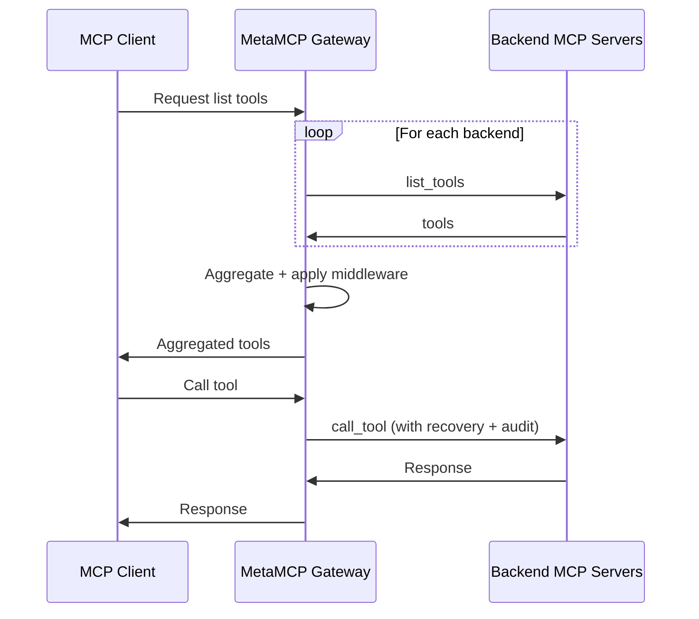

# MetaMCP — Umbrella IT Group fork

> **A maintained downstream fork of [`metatool-ai/metamcp`](https://github.com/metatool-ai/metamcp).**
> Upstream went effectively unmaintained from **2026-02-08 through mid-June 2026**. During that window we carried the community's open PRs plus our own reliability and security-hardening fixes on top of upstream, on the [`umbrella`](https://github.com/Umbrella-IT-Group/metamcp/tree/umbrella) branch — the default and deployable line of this repo. `main` mirrors upstream. MIT-licensed; upstream copyright preserved. Full change record: [`UMBRELLA_FORK.md`](UMBRELLA_FORK.md).

<div align="center">

[](https://opensource.org/licenses/MIT)
[](https://github.com/Umbrella-IT-Group/metamcp/pkgs/container/metamcp)
[](https://github.com/metatool-ai/metamcp)

</div>

**MetaMCP** is an MCP proxy that dynamically aggregates multiple MCP servers into a single unified MCP server and applies middleware. Because MetaMCP is itself an MCP server, it plugs into **any** MCP client. This fork keeps that product intact and concentrates on making it hold up as a long-running, self-hosted gateway.


---

## Contents

- [Why this fork exists](#why-this-fork-exists)
- [Stability](#stability)
- [What we focus on](#what-we-focus-on)
- [What we added over upstream](#what-we-added-over-upstream)
- [Security](#security)
- [Where we diverged from upstream](#where-we-diverged-from-upstream)
- [Branch model](#branch-model)
- [Relationship to upstream and attribution](#relationship-to-upstream-and-attribution)
- [Quick start](#quick-start)
- [Configuration](#configuration)
- [Concepts](#concepts)
- [Connect a client](#connect-a-client)
- [Authentication](#authentication)
- [Architecture](#architecture)
- [Contributing and upstreaming](#contributing-and-upstreaming)
- [License](#license)
- [Credits](#credits)

## Why this fork exists

MetaMCP is a genuinely useful piece of infrastructure, and its author was candid about the maintenance slowdown (see upstream's [`recent-updates.md`](recent-updates.md)). For roughly four months there were no merges upstream while real, spec-level bugs sat in open PRs — chief among them an OAuth defect that disconnected Claude.ai custom MCP connectors every 60 minutes.

When upstream stalled, those fixes needed to live on a line that could actually be built and shipped. So `umbrella` became that line: community PRs upstream hadn't reviewed yet, plus patches for defects that surface in long-running gateway deployments. In June 2026 upstream revived on its `ai-dev` branch and merged a large batch of community work — including several contributions from this fork. We reconciled which deltas converged upstream and made a deliberate decision to keep maintaining a separate line (details in [`UMBRELLA_FORK.md`](UMBRELLA_FORK.md)).

## Stability

Upstream's `ai-dev` README links this repository directly, in its "Latest Update" banner:

> There is also a community maintained fork (ty a lot!): https://github.com/Umbrella-IT-Group/metamcp

Two things to read honestly here. Upstream frames `ai-dev` as its **experimental** line — its own README asks you to *"test before you build the image based on this branch"* because it *"contains ai agent changes"* — and offers this fork as the community-maintained alternative. Upstream does **not** use the word "stable"; that framing is this fork's, not an upstream endorsement.

What we can state factually:

- `umbrella` is the maintained, deployable line of this repo: every change lands there first, and the published image is built from it.
- Every merge to `umbrella` passes type-check, lint, backend `vitest`, and a full production Docker build before it ships.
- The fixes here are reliability and security-hardening fixes on top of upstream, and each ships with regression tests (the fork carries 300+ backend test cases beyond the upstream baseline).

We make **no guarantee for your environment**. Read [`UMBRELLA_FORK.md`](UMBRELLA_FORK.md) for the full per-change record, and test the image before you depend on it — the same advice upstream gives for `ai-dev`.

## What we focus on

One thing: **reliability of a self-hosted gateway that stays connected**. The consumers this fork targets — Claude.ai custom connectors, Claude Code, n8n, and long-running agents — hold long-lived sessions and reconnect poorly when a backend or the gateway restarts under them. Our work concentrates on four properties:

- **Session survival across restarts** — a gateway restart, a backend container swap, or a transport drop should be transparent to connected clients, not a manual `reconnect` ritual.
- **OAuth longevity** — connectors authenticate once and stay authenticated, instead of dropping on a hardcoded 1-hour token.
- **Access control (RBAC)** — not every authenticated user should be a full admin.
- **Observability** — who called which tool, whether a backend is actually reachable, and what the pool is really doing.

## What we added over upstream

Grouped by the property they defend. Every entry maps to one or more fork PRs documented in [`UMBRELLA_FORK.md`](UMBRELLA_FORK.md).

### Session survival across restarts

- **Session-lost and transport-lost recovery** — detectors that recognize the many wrap shapes of a dead backend session (`-32600 "Session not found"`) or a dead transport (`"Not connected"`), walking `.cause` chains and nested envelopes, wired into every proxy call site (tools/call, dynamic-find, aggregate list handlers, and the OpenAPI bridge). Recovery invalidates the stale pooled connection and retries once, transparently.
- **Lazy session recovery across gateway restarts** — session metadata is persisted to an `mcp_sessions` table on init (session id, namespace, endpoint, hashed auth principal, init params). After the gateway restarts with an empty in-memory pool, a returning client's cached `Mcp-Session-Id` is re-validated against the table in constant time, the transport is rebuilt, and the request is replayed — including replaying the MCP `initialize` handshake so the rebuilt transport is actually usable.
- **`boot_id` + `capability_hash` recovery gating** — recovery is allowed only when the gateway's advertised capability set is unchanged since the session was created. A frozen capability object is both declared on the server and hashed; a matching hash means recovery is safe, a differing hash forces a clean re-init. This prevents handing a client a transport whose negotiated capabilities are stale.
- **Auto-nuke stale sessions on capability change** — on the first boot after a capability change, rows whose `capability_hash` no longer matches are deleted in one pass, so a capability-changing deploy surfaces the client re-init path at most once instead of wedging sessions indefinitely.

### Connection-pool robustness

- **Subprocess leak fix** — child processes of terminated STDIO servers no longer leak and eventually OOM the host (graceful SIGTERM + a concurrency-safe idle-session guard).
- **LRU eviction at the global connection cap** — the total-connections cap is a soft LRU bound, not a hard refuse that deadlocks the pool when it fills with persistent sessions.
- **Connection caps honor their env vars** — `MAX_TOTAL_CONNECTIONS` / `MAX_CONNECTIONS_PER_SERVER` are actually enforced (a long-standing bug had the singleton hardcode 100 / 5 regardless of configuration).
- **HTTP/SSE transport-drop detection + exponential reconnect backoff** — parity with STDIO's process-crash handling, so idle HTTP/SSE backends don't sit on dead sockets after a container swap.
- **Active-connection health sweeps + half-open probes** — active pooled connections are health-checked (not just idle ones), and error-gated backends get a periodic half-open probe so a recovered backend heals hands-free.
- **Public-session TTL sweeper** — idle public StreamableHTTP sessions are reaped on a configurable TTL (row-preserving, so the consumer lazy-recovers on its next request), fixing pool saturation from clients that never send a `DELETE`.

### OAuth longevity

- **OAuth `refresh_token` grant** — implements the refresh-token grant that upstream advertised in discovery metadata but rejected at the token endpoint (the root cause of connectors dropping every 60 minutes). Refresh tokens are single-use / rotate on redemption.
- **Env-configurable token TTLs** — access, refresh, and better-auth session lifetimes are all env-var configurable, with defaults tuned for connectors that lack revoke-friendly UX: **24h access / 365d refresh / 30d session**.

### Access control

- **RBAC admin gate on tRPC mutations** — a `users.role` (`admin` / `member`) surfaced into the session; an `adminProcedure` gates all destructive/config mutations (create/update/delete of servers, namespaces, endpoints; namespace curation; tools catalog writes; global config; API-key administration; public-key minting). Members keep read surfaces and manage their own private keys. Plus API-key `last_used_at` telemetry.
- **Endpoint access groups** — named groups that decide which OAuth users may reach which endpoints, so publishing one connector per business system no longer means publishing all of them to everyone who can log in. See [Access groups](#access-groups).

### Observability

- **`/health/upstream` rollup** — a health endpoint reporting per-backend reachability and pool config, truthful for down HTTP/SSE backends (which never trip the STDIO crash breaker).
- **Live Logs with consumer identity + tool-call auditing** — the Live Logs view records connection, tool-call, client-session, and server events with categories and filters; every proxied `tools/call` is audited with the authenticated caller (API-key name or OAuth email), tool, backend, duration, and outcome. A persistent `tool_call_audit` table stores a hash of arguments (never the raw args) with configurable retention.
- **Durable gateway event history** — the Live Logs page has a **History** mode backed by a persistent `gateway_events` table, so connection, client-session, server and system activity survives a restart instead of living only in a 2000-entry in-memory buffer. Browsable by time range, category, level, server, client and message substring, with keyset paging. Rows are **immutable for 30 days** at the database level (UPDATE and TRUNCATE are refused at any age; DELETE is refused inside the window), and age out after `GATEWAY_EVENTS_RETENTION_DAYS`.

### No-reboot tool updates

- **`tools/list_changed` propagation** — the gateway advertises `listChanged: true` and forwards backend tool-list changes to clients, instead of requiring a reconnect to learn about new/removed tools.
- **Full-definition tool hashing + periodic sweep** — tool-list drift is detected on the full `{name, description, inputSchema}` (not just names), and a periodic pull sweep catches updates that arrive as container replacements (where no push notification survives).
- **Per-server "Reconnect Server"** — a UI action that flushes a single backend's pooled connection without restarting the gateway.

## Security

This fork treats the gateway as an internet-facing, multi-user service and hardens it
accordingly. Beyond the reliability work above, the `umbrella` branch adds defense-in-depth
across the management and OAuth surfaces:

- **Role-based access control** on the management API and the Inspector/proxy routes — admin
  actions and diagnostics require an admin session, not merely an authenticated one.
- **Secret redaction** in API responses — API-key values, per-server credentials, and OAuth
  tokens are never returned in list/get/update payloads.
- **API keys hashed at rest** — the `api_keys` table stores a SHA-256 of each key plus its
  last four characters, never the key itself, so read access to that table (a backup, a
  replica, a `psql` session) no longer yields working credentials. A key is shown exactly
  once, in the response that mints it; it cannot be read back out of `api_keys` afterwards, so
  an uncopied key must be re-minted. Bearer tokens configured on MCP-server rows are a separate
  store and are still held as given — including the freshly minted key an auto-created endpoint
  server is configured with — so `mcp_servers.bearer_token` remains in scope for database-read
  exposure. Existing keys keep working across the upgrade — the migration hashes what is
  already stored rather than requiring a re-mint. `BOOTSTRAP_API_KEYS` entries consequently
  require a `key` value that the operator generates: with nothing readable stored, bootstrap
  cannot invent a key and hand it back, so an entry without one is skipped with a warning
  rather than silently creating a credential nobody can obtain. Re-declaring a different value
  for an existing key name rotates that key.
- **Fail-closed registration** — self-registration defaults to disabled and stays disabled
  across restarts; unauthenticated endpoints require an explicit opt-in.
- **Bounded Dynamic Client Registration** — field/size caps, a scoped body limit, retention of
  unused clients, and a dedicated rate-limit bucket.
- **Per-caller rate limiting on password sign-in** — the credential sign-in endpoint is capped
  per client IP, which also bounds how fast the append-only audit log can be filled with failed
  logins. SSO, callbacks, session reads and sign-out are deliberately not capped. See
  [Sign-in rate limiting](#sign-in-rate-limiting).
- **Hardened OAuth surface** — allowlisted redirect URIs at authorize time, authenticated token
  introspection, and consent protection on the authorize flow.
- **Tamper-evident audit logging** of authentication and administrative events.
- **Optional NOSUPERUSER runtime database role** — the gateway can serve requests with a
  credential that is allowed to append to the audit tables and not to rewrite them. See below.

### Separating the runtime credential from the migration credential

By default the gateway connects with `DATABASE_URL`, which on the `postgres:16-alpine` image
is the cluster bootstrap **superuser**, and that same credential serves both `drizzle-kit
migrate` and the running application. A superuser bypasses `GRANT`s outright and can disable a
trigger for its own session or drop it, so the append-only triggers on `audit_log` are
bypassable by the credential the gateway is holding every second it is running. Migrations
genuinely need that privilege. Serving requests does not.

Setting **`METAMCP_RUNTIME_DB_PASSWORD`** splits the two. The container entrypoint runs
`scripts/ensure-runtime-role.sh` after migrations and before either server process starts; it
creates (or converges) a `NOSUPERUSER LOGIN` role, grants it ordinary DML on the application
tables, and revokes the verbs that define immutability. The backend then reports at boot which
role it authenticated as and whether that role is a superuser.

| Table | Runtime role keeps | Runtime role is refused | Why |
|---|---|---|---|
| Ordinary application tables | `SELECT, INSERT, UPDATE, DELETE` | `TRUNCATE`, DDL | The gateway's normal working set. |
| `audit_log` | `SELECT, INSERT` | `UPDATE, DELETE, TRUNCATE` | Append-only. Nothing prunes it in-app; its retention is a deliberate ops-level act performed as the owner. |
| `tool_call_audit` | `SELECT, INSERT, DELETE` | `UPDATE, TRUNCATE` | `DELETE` stays because the `TOOL_AUDIT_RETENTION_DAYS` pruner removes aged rows, and migration `0032` narrows that `DELETE` to rows older than 30 days. See the note below. |
| `gateway_events` | `SELECT, INSERT, DELETE` | `UPDATE, TRUNCATE` | Same shape and same reason: the `GATEWAY_EVENTS_RETENTION_DAYS` sweeper needs `DELETE`, and migration `0031` narrows it to rows older than 30 days. |
| `drizzle` schema (migration journal) | nothing | everything | Never granted. A runtime role that can edit the journal can make a migration appear applied. |

| Variable | Default | Purpose |
|---|---|---|
| `METAMCP_RUNTIME_DB_PASSWORD` | unset | **The switch.** Password for the runtime role; setting it enables the split. |
| `METAMCP_RUNTIME_DB_ROLE` | `metamcp_runtime` | Runtime role name. |
| `RUNTIME_DATABASE_URL` | unset | Escape hatch: a full connection string used verbatim, for a separate host, a pooler, or a managed instance where the role is provisioned outside this repo. Wins over the two above, and does **not** run the entrypoint's ensure-role step. |

Cutover order:

1. Set `METAMCP_RUNTIME_DB_PASSWORD` in `.env` to a strong value.
2. `docker compose up -d` (a recreate, not a restart — the variable has to reach the entrypoint).
3. Confirm the boot log carries `Runtime DB role check (main pool): connected as "metamcp_runtime", rolsuper=false` and the same for the audit pool. The failure shape is the same line with `rolsuper=true` and the words `remain bypassable by this credential` — that means the split did not take. It is also written to `audit_log` as `db.runtime_split.ineffective`, so it can be alerted on rather than only watched for.

The dev stack (`docker-compose.dev.yml`) runs the same step from its own entrypoint, so it honours the switch too. Both compose files read the same `.env`.

**How far the grants go on their own.** `audit_log` is refused all three wipe verbs, so its grants alone make it append-only. `tool_call_audit` and `gateway_events` both have to keep `DELETE` for their retention sweepers, so grants alone could not stop that credential emptying either table rather than pruning its aged tail. Migrations `0032` and `0031` close the difference with database triggers, identical on both: `UPDATE` and `TRUNCATE` are refused outright at any row age, and `DELETE` is refused for any row inside the last 30 days. Neither sweeper is affected at its 90-day default, which is 60 days past that boundary, and neither can be configured into the window: both retention variables are floor-clamped to 30 at boot with a warning, so the application never issues a prune the database would refuse.

**What none of this covers.** A superuser can still disable a trigger or set `session_replication_role`, and the owner of a table can disable its triggers. That break-glass path is left open on purpose, for a legal hold or a corrupted row, and using it is worth recording because at the database level it is indistinguishable from tampering. Enabling the split is what puts it out of the gateway's own reach: the runtime role is `NOSUPERUSER` and does not own these tables, so it holds neither lever.

Leaving the variable unset is fully supported and changes nothing: the entrypoint step is
skipped and the gateway connects with `DATABASE_URL` exactly as before.

**Adding an audit table later:** the ensure-role script uses `ALTER DEFAULT PRIVILEGES`, so a
table created by a future migration starts out fully writable by the runtime role. Any new
append-only table must be added to the revoke list in `scripts/ensure-runtime-role.sh`; a test
asserts that every table a migration protects with an immutability trigger appears there.

See [`UMBRELLA_FORK.md`](UMBRELLA_FORK.md) for the per-change record, and [`SECURITY.md`](SECURITY.md)
to report an issue. Several of these items apply to upstream unchanged; we coordinate them privately
with the upstream maintainers before any public detail.

## Where we diverged from upstream

These are deliberate, documented differences from `metatool-ai/metamcp`.

- **Single-tenant posture.** This gateway serves a single organization and connects to each backend MCP server using shared, static, per-server service credentials configured on the gateway. We do not model per-caller identity flowing through to backends (with one scoped exception, below).
- **We declined the multi-tenant per-server header-forwarding path (upstream [#256](https://github.com/metatool-ai/metamcp/pull/256)).** That PR forwards per-client headers to backends to enable cross-tenant routing. It merged upstream, but it does not fit this fork's model: backends authenticate via shared service credentials, so per-client header forwarding adds attack surface and complexity for a capability the fork deliberately doesn't want. We do not carry it.
- **Default-public visibility, OAuth-on endpoints.** New namespaces/endpoints/servers default to "Everyone" ownership and new endpoints default OAuth-on — an Umbrella-specific policy stance, not upstream's default.
- **Per-user Microsoft 365 delegated-token broker** (Umbrella-specific extension). A scoped, opt-in exception to the single-tenant posture: for one designated backend, the gateway mints a per-user delegated Graph token request-scoped via `AsyncLocalStorage`, with encrypted token custody. Upstream has no per-user backend-credential concept; this lives entirely in our line.
- **Branding.** MetaMCP wordmarks are replaced with the Umbrella IT Group brandmark on the sidebar and browser tab. Cosmetic and fork-specific.

## Branch model

| Branch | Role |
|---|---|
| `umbrella` | Our integration line. **Default branch.** All deployable work lives here; built into `ghcr.io/umbrella-it-group/metamcp:latest`. |
| `main` | Mirror of upstream `metatool-ai/metamcp:main`. We never push our changes here. |
| `feature/<name>` | Short-lived per-PR branches off `umbrella`, squash-merged and deleted. |

Note: after upstream's June 2026 revival on `ai-dev`, we made a deliberate decision to **stay on frozen `main`** rather than rebase onto `ai-dev`. Several of our patches converged upstream in that revival; we continue to carry them as deltas by choice, because our line has diverged (single-tenant posture, RBAC, M365 broker, zod v4 / MCP SDK 1.29) in ways a blanket rebase would fight. See [`UMBRELLA_FORK.md`](UMBRELLA_FORK.md) for the convergence record and the reasoning.

## Relationship to upstream and attribution

This fork exists because of, and on top of, `metatool-ai/metamcp` by James Zhang. Credit and thanks to the upstream author and to every community contributor whose PRs we carry.

Some of our work merged back upstream during the June 2026 `ai-dev` revival — the OAuth/session-lifetime configurability, the session-recovery error detectors, and the 404 re-init fix among them. Where a patch we authored is generic (not Umbrella-specific), we file it upstream; the "Our own patches" table in [`UMBRELLA_FORK.md`](UMBRELLA_FORK.md) doubles as that backlog.

Upstream community resources (Discord, docs, DeepWiki) live at [`metatool-ai/metamcp`](https://github.com/metatool-ai/metamcp) and [docs.metamcp.com](https://docs.metamcp.com).

## Quick start

### Run the prebuilt image

```bash
docker pull ghcr.io/umbrella-it-group/metamcp:latest
```

Wire it into your own `docker-compose.yml` alongside a Postgres instance. The image is amd64 and published on every push to `umbrella`.

### Build from source with Docker Compose

`umbrella` is the default branch, so a plain clone lands you on the deployable line:

```bash
git clone https://github.com/Umbrella-IT-Group/metamcp.git
cd metamcp
cp example.env .env   # then edit .env
docker compose up -d
```

Edit `.env` before that first `docker compose up`. `POSTGRES_PASSWORD` has no default in any of the compose files: leave it unset and compose stops and names it, rather than falling back to a password published in this repository. `example.env` assigns it an obvious placeholder, which is enough to get past that check but is not a password. Replace it. `BETTER_AUTH_SECRET` is required the same way and for a sharper reason: it is the session signing key, so whoever holds it can mint a session cookie for any account without a password, and its old compose default was published here too. Generate one with `openssl rand -hex 32`. Unlike `POSTGRES_PASSWORD` it has no initdb coupling, so an existing deployment can change it at any time; doing so invalidates sessions signed with the old key and signs everyone out once. Upgrading an existing deployment: Postgres reads `POSTGRES_PASSWORD` only when the data volume is first initialized, so a volume created under the old published default keeps that password until you run `ALTER USER metamcp_user WITH PASSWORD '<new>'` in the running database; set `.env` to whatever the volume actually uses, or rotate with `ALTER USER` first, otherwise the app fails Postgres authentication on next start. The other thing to edit is the bootstrap account. This fork ships **registration closed** (`BOOTSTRAP_DISABLE_REGISTRATION_UI=true`, see [Registration controls](#registration-controls)), so nobody can self-register a first administrator through the UI: the account bootstrap creates is the only way in. Out of the box that is `example.env`'s placeholder `BOOTSTRAP_USER_EMAIL` / `BOOTSTRAP_USER_PASSWORD` pair (`test@user.example` / `REPLACE_ME__generate_a_strong_password`), which is a placeholder rather than credentials you want on a running gateway. The backend warns loudly at boot if that placeholder is still the configured password, and again if `BETTER_AUTH_SECRET` is still `example.env`'s. Set `BOOTSTRAP_USERS` (a JSON array, the recommended form) or those two single-user variables to real values first.

If you change `APP_URL`, access the app only from that URL. MetaMCP applies CORS per route: the OAuth discovery endpoints allow any origin, while the app and API routes (`/api/auth`, `/trpc`, `/mcp-proxy`, `/metamcp`) are restricted to an allowlist of `APP_URL` plus any origins you add to `EXTRA_TRUSTED_ORIGINS` (comma-separated). The Postgres volume name is global and may collide with other Postgres containers; rename `metamcp_postgres_data` in `docker-compose.yml` if needed.

### Local development

```bash
pnpm install
pnpm dev
```

(Postgres via Docker is still the easy path for local dev.) Common gates: `pnpm check-types`, `pnpm lint`, `pnpm --filter @metamcp/backend test` (backend vitest), `pnpm build`.

## Configuration

Standard upstream configuration (Postgres, `APP_URL`, OIDC/SSO, rate limits) is unchanged; see [`example.env`](example.env). Three upstream DEFAULTS change in this fork: the registration controls, and `POSTGRES_PASSWORD` and `BETTER_AUTH_SECRET`, whose published compose defaults are removed rather than replaced (both variables are now required). Everything else below is additive. All are optional; defaults are shown.

The database-credential variables (`METAMCP_RUNTIME_DB_PASSWORD`, `METAMCP_RUNTIME_DB_ROLE`, `RUNTIME_DATABASE_URL`) are documented with their grant matrix under [Security](#separating-the-runtime-credential-from-the-migration-credential) rather than repeated here.

### Registration controls

| Variable | Default | Purpose |
|---|---|---|
| `BOOTSTRAP_DISABLE_REGISTRATION_UI` | `true` (upstream: `false`) | Disable self-service signup in the web UI. |
| `BOOTSTRAP_DISABLE_REGISTRATION_SSO` | `true` (upstream: `false`) | Disable account creation on a first SSO/OIDC login. |

Both fail closed: an unset variable, or an unparseable one, reads as `true`, so a deploy that never mentions them does not silently run with open self-registration. Provision accounts through `BOOTSTRAP_USERS` instead, or flip a control off deliberately.

Bootstrap is exempt from its own lock, and it has to be. It creates the configured accounts by signing them up through the same route `DISABLE_SIGNUP` closes, and it writes that flag to the `config` table on every run, so from the second boot onward the flag is already stored `true` when bootstrap starts. With `BOOTSTRAP_RECREATE_USER=true` the administrator (and its user-scoped API keys) is deleted before the re-signup, so a refusal there would leave an ordinary restart with no administrator, registration closed, and the keys unrecoverable. Bootstrap therefore opens a signup exemption around its user pass and closes it in a `finally` immediately after. The exemption is not reachable from outside the process: all of this runs before the HTTP server starts listening, so no request can arrive while it is open, and it covers only bootstrap's own accounts, never a request. The created account is still recorded in the audit log like any other.

One limit worth knowing: these controls are only asserted when bootstrap runs at all. A `BOOTSTRAP_ENABLE=false` deploy writes no row, which upstream's readers treat as open, so such a deploy keeps upstream's behaviour and has to close registration by hand in the admin UI.

### Sign-in rate limiting

| Variable | Default | Purpose |
|---|---|---|
| `AUTH_SIGNIN_RATE_LIMIT_MAX` | `20` | Password sign-in attempts allowed per window, per client IP. Unparseable, zero and negative values fall back to the default with a boot warning rather than being honoured — a `0` would refuse every sign-in. Capped at `1000`, above which it is not a bound. |
| `AUTH_SIGNIN_RATE_LIMIT_WINDOW_SECONDS` | `600` (10m) | Length of the fixed window. Same fallback rule: `0` would expire the window on every request and silently remove the limit. Capped at `86400` (24h), so a refused caller is never locked out for longer than a day. |
| `AUTH_SIGNIN_RATE_LIMIT_DISABLED` | unset (limiter on) | Set to exactly `true` to turn the limiter off. Phrased negatively on purpose: unset, empty and misspelled all leave it on. |

`POST /api/auth/sign-in/email` is the only path this covers, and the exclusions are deliberate. SSO entry (`sign-in/social`, `sign-in/oauth2`) and its callbacks carry no credential and are the flows a lockout would break; `get-session` is read on nearly every page render; `sign-out` must never be answered with "try again later"; and dynamic client registration (`/api/auth/register`) already has its own bucket and is what the loopback OAuth pairing depends on.

The key is the edge-supplied client IP (`CF-Connecting-IP`), the same key the failed-auth, registration and `/trpc` limiters use — not `req.ip`, which is one shared in-container address for every caller behind the frontend rewrite and would make the limiter an organisation-wide lockout rather than a bound. **Requests arriving without that header are exempt rather than pooled into one bucket**, for the same reason: a shared bucket would be the lockout. The honest cost is that a caller reaching the origin directly, beside the tunnel, is not bounded by this.

Better-auth's own rate limiter stays pinned off and should not be enabled instead. Its address resolution reads `x-forwarded-for` only and accepts it solely when it carries exactly one entry, so behind a proxy chain every caller collapses into the literal bucket `no-trusted-ip` — at 3 sign-ins per 10 seconds, shared globally.

A refusal is a `429` with a `Retry-After` and writes no audit row (a row per refusal would amplify the writes being bounded); it is reported to the log instead, at most one line a minute, carrying a running total since startup.

### OAuth and session lifetimes

| Variable | Default | Purpose |
|---|---|---|
| `OAUTH_ACCESS_TOKEN_TTL_SECONDS` | `86400` (24h) | MCP OAuth access-token lifetime (was hardcoded 1h upstream). |
| `OAUTH_REFRESH_TOKEN_TTL_SECONDS` | `31536000` (365d) | MCP OAuth refresh-token lifetime. Refresh tokens rotate on use. |
| `BETTER_AUTH_SESSION_EXPIRES_IN_SECONDS` | `2592000` (30d) | Better-auth session lifetime. |
| `BETTER_AUTH_SESSION_UPDATE_AGE_SECONDS` | `604800` (7d) | Better-auth session refresh age. |
| `SESSION_LIFETIME` | unset (persistent) | Backend MCP session lifetime; unset = never expire. |

### Connection pool and recovery

| Variable | Default | Purpose |
|---|---|---|
| `MAX_TOTAL_CONNECTIONS` | `100` | Global backend-connection cap (soft LRU bound). |
| `MAX_CONNECTIONS_PER_SERVER` | `5` | Per-backend connection cap. |
| `MCP_SESSION_TTL_DAYS` | `7` | Age after which persisted `mcp_sessions` rows are pruned. |
| `MCP_SESSION_PRUNER_INTERVAL_MS` | `86400000` (24h) | Pruner interval. |
| `MCP_AUTO_NUKE_ON_CAPABILITY_CHANGE` | `true` | Delete capability-stale sessions on first boot after a capability change. |
| `MCP_ACTIVE_HEALTH_CHECK` | on | Health-check active pooled connections, not just idle ones. |
| `MCP_ERROR_PROBE_INTERVAL_MS` | `300000` (5m) | Half-open probe interval for error-gated backends. |
| `MCP_RECONNECT_BACKOFF_INITIAL_MS` / `_MAX_MS` / `_MULTIPLIER` | `1000` / `30000` / `2` | Exponential reconnect backoff schedule (with jitter). |
| `MCP_RECOVERY_RESET_THRESHOLD_MS` | `300000` (5m) | Recent-success window within which a transport drop resets the circuit breaker. |

### Observability and sweeps

| Variable | Default | Purpose |
|---|---|---|
| `LOG_MAX_SIZE_MB` | `50` | In-container log-file rotation threshold. |
| `TOOL_AUDIT_RETENTION_DAYS` | `90` | `tool_call_audit` retention. `0` or negative keeps rows forever (pruning is skipped entirely). Values `1`-`29` are raised to `30` at boot with a warning, because migration `0032` makes rows undeletable inside a 30-day window. |
| `GATEWAY_EVENTS_RETENTION_DAYS` | `90` | `gateway_events` retention. Floor-clamped to 30 with a boot warning: rows are immutable for their first 30 days at the database level, so a lower value cannot take effect. There is no "keep forever" value. Reclaiming in-window space is a deliberate break-glass act, not a config change — see below. |
| `AUDIT_STORAGE_CHECK_INTERVAL_SWEEPS` | `12` | How many 5-minute cleanup sweeps between audit-table storage checks, so the default is hourly. Values below `1` fall back to the default and anything above `288` (24h) is capped, both with a boot warning: there is deliberately no value that turns the check off. The per-check reading is logged at INFO, so it only reaches stdout (and therefore a log shipper) when `LOG_LEVEL` is `info` or `all`; see the note below. |
| `AUDIT_STORAGE_WARN_MB` | `2048` | Per-table size at which the storage check escalates from an INFO line to a WARN plus a `system` event in the gateway history. At most one warning per table per 24h while the condition lasts; a table falling below 90% of the threshold re-arms it. Capped at `1048576` (1 TiB) with a boot warning, so a threshold nothing can reach cannot be used as an off switch. |
| `TOOLS_SWEEP_INTERVAL_SECONDS` | `60` | Periodic tool-definition drift sweep (`0` disables). |
| `PUBLIC_SESSION_TTL_SECONDS` | `86400` (24h) | Idle-time TTL for public StreamableHTTP sessions before reap. |
| `SESSION_SWEEP_INTERVAL_SECONDS` | `300` | Public-session sweeper interval (`0` disables). |

**Break-glass on `gateway_events` and `tool_call_audit`.** Both carry the same 30-day window (migrations `0031` and `0032`), so the same rules apply to each. Nothing in the application can delete a row inside that window, and that includes the retention sweepers: a `DELETE` that touches even one in-window row raises, and the raise rolls back the entire statement, so a mixed-range prune reclaims nothing rather than partially succeeding. That rollback is why both retention variables are floor-clamped rather than trusted: an under-range setting would stop pruning altogether instead of shortening it. Reclaiming space early therefore requires a superuser at the database — `ALTER TABLE <table> DISABLE TRIGGER <table>_no_recent_delete`, or `SET session_replication_role = 'replica'` for the session — and re-enabling afterwards. Treat that as an audit-worthy act: it is the one operation that can remove evidence these tables exist to preserve, it leaves no trace in the table itself, and the ordinary answer to a full disk is to lower the retention variable toward its floor and wait for the window to pass.

**Audit storage tripwire.** Because that answer takes up to 30 days to have any effect, the useful defence against unbounded growth is noticing early rather than reacting late. The cleanup sweep therefore measures all three audit tables every `AUDIT_STORAGE_CHECK_INTERVAL_SWEEPS` ticks (hourly by default) and logs one line per table:

```
[audit-storage] table=gateway_events est_rows=1284310 total_bytes=612368384 total_mb=584.0 threshold_mb=2048
```

The figures come from `pg_class.reltuples` and `pg_total_relation_size`, never from `count(*)`: a count would be a sequential scan of exactly the table that got too big, so the monitor's cost would grow with the problem it is watching for. `est_rows` reads `unknown` until a table has been analyzed, which is honest rather than a zero. When a table reaches `AUDIT_STORAGE_WARN_MB` the same line escalates to a WARN and a `system` event is written to `gateway_events`, so the warning shows up in the Live Logs **History** view alongside everything else the operator already reads, not only in whatever collects container logs. That warning repeats at most once per table per 24 hours, and a table that falls back below 90% of the threshold re-arms for an immediate warning on its next crossing. There is no write-side rate limit on these tables by design: capping the writes would mean choosing at write time which security records to drop, and a dropped record is unrecoverable in exactly the tables that exist to be complete.

**Set `LOG_LEVEL=info` if you want the per-check reading in your log stack.** The hourly line is logged at INFO, and the console mirror only carries INFO when `LOG_LEVEL` is `info` or `all`; the default when `LOG_LEVEL` is unset is `errors-only`, whose floor is WARN. On a default-configured deployment the reading therefore lands in the in-container application log but never on stdout, so nothing shipping container logs will see it. The threshold warning is a WARN and clears that floor at every setting except `none`, and its `gateway_events` row is written regardless of `LOG_LEVEL` at all: the escalation is deliberately not dependent on logging configuration, which is why it is the layer that carries the signal that must not be missed.

## Concepts

The core model is unchanged from upstream.

- **MCP Server** — a configuration telling MetaMCP how to start or connect to an MCP server (STDIO via `uvx`/`npx`, or remote SSE/StreamableHTTP). STDIO servers support raw env values, `${ENV_VAR}` references resolved from the container, and auto-matching of same-named env vars.
- **Namespace** — a group of MCP servers. Enable/disable servers or individual tools, apply middleware, and override tool names/titles/descriptions or attach annotations per namespace.
- **Endpoint** — a public surface bound to a namespace, hosted over **SSE**, **Streamable HTTP**, or **OpenAPI**, with **API-key** or **OAuth** auth. Multiple servers in the namespace are aggregated into one endpoint.
- **Middleware** — intercepts and transforms MCP requests/responses at the namespace level (e.g. "filter inactive tools"). This fork adds a tool-call **auditing** middleware.
- **Inspector** — the MCP inspector with saved server configs, for debugging your endpoints in place.

## Connect a client

Endpoints are remote (SSE / Streamable HTTP / OpenAPI). Example Cursor `mcp.json`:

```json
{
  "mcpServers": {
    "MetaMCP": {
      "url": "http://localhost:12008/metamcp/<YOUR_ENDPOINT_NAME>/sse"
    }
  }
}
```

STDIO-only clients (e.g. Claude Desktop) need a local proxy. `mcp-proxy` works with MetaMCP's API-key auth (`mcp-remote` does not):

```json
{
  "mcpServers": {
    "MetaMCP": {
      "command": "uvx",
      "args": [
        "mcp-proxy",
        "--transport", "streamablehttp",
        "http://localhost:12008/metamcp/<YOUR_ENDPOINT_NAME>/mcp"
      ],
      "env": { "API_ACCESS_TOKEN": "<YOUR_API_KEY>" }
    }
  }
}
```

Notes: use the API key in an `Authorization: Bearer <API_KEY>` header (the `?api_key=` query param works for Streamable HTTP and OpenAPI, not SSE). Replace `<YOUR_ENDPOINT_NAME>` and the key (format `sk_mt_...`).

## Authentication

- **Better Auth** for frontend and backend (tRPC), with session cookies enforcing secure internal proxy connections.
- **API-key auth** for external access via `Authorization: Bearer <api-key>`.
- **MCP OAuth** on exposed endpoints (MCP Spec 2025-06-18), with this fork's refresh-token grant and configurable TTLs.
- **RBAC** — `admin` vs `member` roles; destructive and config mutations are admin-gated (see [What we added](#what-we-added-over-upstream)).
- **OIDC / SSO** — Auth0, Keycloak, Azure AD, Google, Okta, etc., with PKCE and separate UI/SSO registration controls. See [`CONTRIBUTING.md`](CONTRIBUTING.md#openid-connect-oidc-provider-setup).

### Access groups

By default an OAuth-authenticated user reaches every public endpoint on the gateway: endpoint access is gated on ownership only, so a public endpoint admits anyone who has completed an authorization flow. On an estate that publishes one connector per business system, that means one login reaches all of them.

Access groups narrow it. A group is a named, reusable set of people; endpoints are mapped to groups; and an individual endpoint opts in with a **Restrict to access groups** switch. Once an endpoint is restricted, an OAuth caller reaches it only if they are an administrator or belong to at least one group mapped to it. Anyone else gets `403` with a single fixed message that names no endpoint and no group.

The switch governs OAuth callers and nothing else, so what it actually does depends on the endpoint's other auth toggles, and the admin UI labels all three cases rather than reporting a bare "restricted":

| endpoint accepts | effect of the switch |
| --- | --- |
| OAuth only | the gate governs every caller |
| OAuth and API keys | it narrows OAuth callers; every API-key holder still reaches the endpoint |
| API keys only | no effect at all, since no caller arrives through the gate |

Administered from **Access Groups** in the sidebar (administrators only), plus an **Access** panel on each endpoint's edit dialog showing the switch and the groups currently mapped to it. Group create/update/delete, membership changes, endpoint mappings and the restriction switch each write an `audit_log` row; so does a refused request.

Three properties worth stating plainly, because each is a deliberate boundary rather than an omission:

- **It ships inert.** No group exists and no endpoint is restricted until an administrator creates and switches them on, so upgrading changes nothing for any existing caller. On an unrestricted endpoint the gate costs one boolean read and no query.
- **API keys are not affected.** A key is minted by an administrator, is held by a machine rather than a person, and already carries its own per-endpoint scoping (`endpoint_uuid` and the per-endpoint *require scoped API key* switch). Gating a server-to-server key on the group membership of whoever happens to own it would break integrations to solve a problem those keys do not have. Use key scoping for machine callers and access groups for people.
- **Groups gate whole endpoints, not individual tools.** There is no per-tool grant, and adding one is not planned. The supported way to give an audience a narrower tool set is the one this platform already has: curate a second namespace containing only the tools they should see, publish a second endpoint over it, and map the group to that endpoint.

Membership decisions are cached in-process for 60 seconds and dropped immediately when any group or endpoint mapping changes, so a revocation takes effect on the caller's next request. Across multiple backend replicas the cache is per-process, and 60 seconds is the worst-case convergence.

One limit worth knowing: the gate runs per request, so restricting an endpoint does not disconnect a notification stream that is already open. No tool call can land through it, because every call is a fresh request that re-runs the gate, but `list_changed` and log notifications keep flowing on that connection until the client disconnects.

For reverse-proxy (nginx) setups with SSE long connections, see [`nginx.conf.example`](nginx.conf.example). A 2–4GB instance is the practical minimum for a hosted deployment.

## Architecture

- **Frontend**: Next.js
- **Backend**: Express.js + tRPC, hosting MCPs through the TS SDK and an internal proxy
- **Auth**: Better Auth
- **Structure**: Turborepo monorepo (`apps/backend`, `apps/frontend`, `packages/zod-types`), Drizzle migrations, Docker publishing
- **Stack notes for this fork**: zod v4, `@modelcontextprotocol/sdk` 1.29



## Contributing and upstreaming

Contributions welcome — see [`CONTRIBUTING.md`](CONTRIBUTING.md). PRs target `umbrella`, squash-merged after review and gates.

When a patch is generic (a bug fix or config option that isn't Umbrella-specific), branch off `main`, open it against `metatool-ai/metamcp`, and once merged upstream we drop our private carry. [`UMBRELLA_FORK.md`](UMBRELLA_FORK.md) tracks the full cherry-pick log, which of our patches converged upstream, and the upstreaming backlog.

## License

**MIT.** The [`LICENSE`](LICENSE) file is unchanged from upstream:

> Copyright 2024 MetaMCP, James Zhang

Our fork-specific changes are marked in commit messages and in [`UMBRELLA_FORK.md`](UMBRELLA_FORK.md). If your project uses this code, a back-link is appreciated.

## Credits

- **[`metatool-ai/metamcp`](https://github.com/metatool-ai/metamcp)** by James Zhang — the upstream project this fork is built on.
- The MetaMCP community, whose PRs this line carries and reconciles.
- Ideas from [MCP Inspector](https://github.com/modelcontextprotocol/inspector), [MCP Proxy Server](https://github.com/adamwattis/mcp-proxy-server), [open-webui/openapi-servers](https://github.com/open-webui/openapi-servers), and [open-webui/mcpo](https://github.com/open-webui/mcpo).
