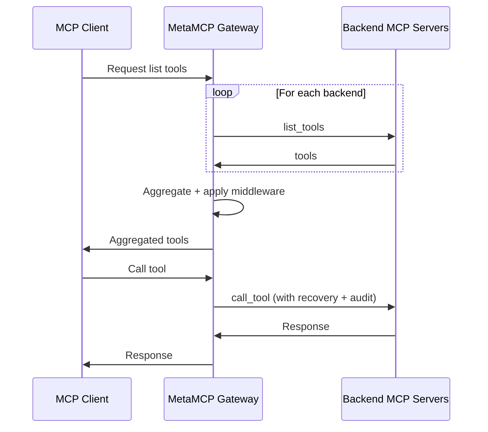

# MetaMCP — Umbrella IT Group fork

> **A maintained downstream fork of [`metatool-ai/metamcp`](https://github.com/metatool-ai/metamcp).**
> Upstream went effectively unmaintained from **2026-02-08 through mid-June 2026**. During that window we carried the community's open PRs plus our own incident-driven fixes on the [`umbrella`](https://github.com/Umbrella-IT-Group/metamcp/tree/umbrella) branch — the default and deployable line of this repo. `main` mirrors upstream. MIT-licensed; upstream copyright preserved. Full change record: [`UMBRELLA_FORK.md`](UMBRELLA_FORK.md).

<div align="center">

[](https://opensource.org/licenses/MIT)
[](https://github.com/Umbrella-IT-Group/metamcp/pkgs/container/metamcp)
[](https://github.com/metatool-ai/metamcp)

</div>

**MetaMCP** is an MCP proxy that dynamically aggregates multiple MCP servers into a single unified MCP server and applies middleware. Because MetaMCP is itself an MCP server, it plugs into **any** MCP client. This fork keeps that product intact and concentrates on making it hold up as a long-running, self-hosted gateway.


---

## Contents

- [Why this fork exists](#why-this-fork-exists)
- [Stability](#stability)
- [What we focus on](#what-we-focus-on)
- [What we added over upstream](#what-we-added-over-upstream)
- [Where we diverged from upstream](#where-we-diverged-from-upstream)
- [Branch model](#branch-model)
- [Relationship to upstream and attribution](#relationship-to-upstream-and-attribution)
- [Quick start](#quick-start)
- [Configuration](#configuration)
- [Concepts](#concepts)
- [Connect a client](#connect-a-client)
- [Authentication](#authentication)
- [Architecture](#architecture)
- [Contributing and upstreaming](#contributing-and-upstreaming)
- [License](#license)
- [Credits](#credits)

## Why this fork exists

MetaMCP is a genuinely useful piece of infrastructure, and its author was candid about the maintenance slowdown (see upstream's [`recent-updates.md`](recent-updates.md)). For roughly four months there were no merges upstream while real, spec-level bugs sat in open PRs — chief among them an OAuth defect that disconnected Claude.ai custom MCP connectors every 60 minutes.

We run MetaMCP as the production gateway in front of every internal MCP server at Umbrella IT Group. When upstream stalled, we needed those fixes on a line we could deploy. So `umbrella` became that line: community PRs upstream hadn't reviewed yet, plus our own patches for problems we hit in production. In June 2026 upstream revived on its `ai-dev` branch and merged a large batch of community work — including several of our contributions. We reconciled which of our deltas converged upstream and made a deliberate decision to keep running our own line (details in [`UMBRELLA_FORK.md`](UMBRELLA_FORK.md)).

## Stability

Upstream's `ai-dev` README links this repository directly, in its "Latest Update" banner:

> There is also a community maintained fork (ty a lot!): https://github.com/Umbrella-IT-Group/metamcp

Two things to read honestly here. Upstream frames `ai-dev` as its **experimental** line — its own README asks you to *"test before you build the image based on this branch"* because it *"contains ai agent changes"* — and offers this fork as the community-maintained alternative. Upstream does **not** use the word "stable"; that framing is ours, and it is an operational claim, not an upstream endorsement.

What we can state factually:

- The `umbrella` branch runs the production MCP gateway at Umbrella IT Group, serving live Claude.ai custom connectors, Claude Code, n8n workflows, and internal agents.
- Every merge to `umbrella` passes type-check, lint, backend `vitest`, and a full production Docker build before it ships.
- The fixes here were driven by real incidents on that gateway, and each ships with regression tests (the fork carries 300+ backend test cases beyond the upstream baseline).

We make **no guarantee for your environment**. Read [`UMBRELLA_FORK.md`](UMBRELLA_FORK.md) for the full per-change record, and test the image before you depend on it — the same advice upstream gives for `ai-dev`.

## What we focus on

One thing: **reliability of a self-hosted gateway that stays connected**. The consumers we care about — Claude.ai custom connectors, Claude Code, n8n, and our own agents — hold long-lived sessions and reconnect poorly when a backend or the gateway restarts under them. Our work concentrates on four properties:

- **Session survival across restarts** — a gateway restart, a backend container swap, or a transport drop should be transparent to connected clients, not a manual `reconnect` ritual.
- **OAuth longevity** — connectors authenticate once and stay authenticated, instead of dropping on a hardcoded 1-hour token.
- **Access control (RBAC)** — not every authenticated user should be a full admin.
- **Observability** — who called which tool, whether a backend is actually reachable, and what the pool is really doing.

## What we added over upstream

Grouped by the property they defend. Every entry maps to one or more fork PRs documented in [`UMBRELLA_FORK.md`](UMBRELLA_FORK.md).

### Session survival across restarts

- **Session-lost and transport-lost recovery** — detectors that recognize the many wrap shapes of a dead backend session (`-32600 "Session not found"`) or a dead transport (`"Not connected"`), walking `.cause` chains and nested envelopes, wired into every proxy call site (tools/call, dynamic-find, aggregate list handlers, and the OpenAPI bridge). Recovery invalidates the stale pooled connection and retries once, transparently.
- **Lazy session recovery across gateway restarts** — session metadata is persisted to an `mcp_sessions` table on init (session id, namespace, endpoint, hashed auth principal, init params). After the gateway restarts with an empty in-memory pool, a returning client's cached `Mcp-Session-Id` is re-validated against the table in constant time, the transport is rebuilt, and the request is replayed — including replaying the MCP `initialize` handshake so the rebuilt transport is actually usable.
- **`boot_id` + `capability_hash` recovery gating** — recovery is allowed only when the gateway's advertised capability set is unchanged since the session was created. A frozen capability object is both declared on the server and hashed; a matching hash means recovery is safe, a differing hash forces a clean re-init. This prevents handing a client a transport whose negotiated capabilities are stale.
- **Auto-nuke stale sessions on capability change** — on the first boot after a capability change, rows whose `capability_hash` no longer matches are deleted in one pass, so a capability-changing deploy surfaces the client re-init path at most once instead of wedging sessions indefinitely.

### Connection-pool robustness

- **Subprocess leak fix** — child processes of terminated STDIO servers no longer leak and eventually OOM the host (graceful SIGTERM + a concurrency-safe idle-session guard).
- **LRU eviction at the global connection cap** — the total-connections cap is a soft LRU bound, not a hard refuse that deadlocks the pool when it fills with persistent sessions.
- **Connection caps honor their env vars** — `MAX_TOTAL_CONNECTIONS` / `MAX_CONNECTIONS_PER_SERVER` are actually enforced (a long-standing bug had the singleton hardcode 100 / 5 regardless of configuration).
- **HTTP/SSE transport-drop detection + exponential reconnect backoff** — parity with STDIO's process-crash handling, so idle HTTP/SSE backends don't sit on dead sockets after a container swap.
- **Active-connection health sweeps + half-open probes** — active pooled connections are health-checked (not just idle ones), and error-gated backends get a periodic half-open probe so a recovered backend heals hands-free.
- **Public-session TTL sweeper** — idle public StreamableHTTP sessions are reaped on a configurable TTL (row-preserving, so the consumer lazy-recovers on its next request), fixing pool saturation from clients that never send a `DELETE`.

### OAuth longevity

- **OAuth `refresh_token` grant** — implements the refresh-token grant that upstream advertised in discovery metadata but rejected at the token endpoint (the root cause of connectors dropping every 60 minutes). Refresh tokens are single-use / rotate on redemption.
- **Env-configurable token TTLs** — access, refresh, and better-auth session lifetimes are all env-var configurable, with defaults tuned for connectors that lack revoke-friendly UX: **24h access / 365d refresh / 30d session**.

### Access control

- **RBAC admin gate on tRPC mutations** — a `users.role` (`admin` / `member`) surfaced into the session; an `adminProcedure` gates all destructive/config mutations (create/update/delete of servers, namespaces, endpoints; namespace curation; tools catalog writes; global config; API-key administration; public-key minting). Members keep read surfaces and manage their own private keys. Plus API-key `last_used_at` telemetry.

### Observability

- **`/health/upstream` rollup** — a health endpoint reporting per-backend reachability and pool config, truthful for down HTTP/SSE backends (which never trip the STDIO crash breaker).
- **Live Logs with consumer identity + tool-call auditing** — the Live Logs view records connection, tool-call, client-session, and server events with categories and filters; every proxied `tools/call` is audited with the authenticated caller (API-key name or OAuth email), tool, backend, duration, and outcome. A persistent `tool_call_audit` table stores a hash of arguments (never the raw args) with configurable retention.

### No-reboot tool updates

- **`tools/list_changed` propagation** — the gateway advertises `listChanged: true` and forwards backend tool-list changes to clients, instead of requiring a reconnect to learn about new/removed tools.
- **Full-definition tool hashing + periodic sweep** — tool-list drift is detected on the full `{name, description, inputSchema}` (not just names), and a periodic pull sweep catches updates that arrive as container replacements (where no push notification survives).
- **Per-server "Reconnect Server"** — a UI action that flushes a single backend's pooled connection without restarting the gateway.

## Where we diverged from upstream

These are deliberate, documented differences from `metatool-ai/metamcp`.

- **Single-tenant posture.** This gateway serves a single organization and connects to each backend MCP server using shared, static, per-server service credentials configured on the gateway. We do not model per-caller identity flowing through to backends (with one scoped exception, below).
- **We declined the multi-tenant per-server header-forwarding path (upstream [#256](https://github.com/metatool-ai/metamcp/pull/256)).** That PR forwards per-client headers to backends to enable cross-tenant routing. It merged upstream, but it does not fit our model: our backends authenticate via shared service credentials, so per-client header forwarding adds attack surface and complexity for a capability we deliberately don't want. We do not carry it.
- **Default-public visibility, OAuth-on endpoints.** New namespaces/endpoints/servers default to "Everyone" ownership and new endpoints default OAuth-on — an Umbrella-specific policy stance, not upstream's default.
- **Per-user Microsoft 365 delegated-token broker** (Umbrella-specific extension). A scoped, opt-in exception to the single-tenant posture: for one designated backend, the gateway mints a per-user delegated Graph token request-scoped via `AsyncLocalStorage`, with encrypted token custody. Upstream has no per-user backend-credential concept; this lives entirely in our line.
- **Branding.** MetaMCP wordmarks are replaced with the Umbrella IT Group brandmark on the sidebar and browser tab. Cosmetic and fork-specific.

## Branch model

| Branch | Role |
|---|---|
| `umbrella` | Our integration line. **Default branch.** All deployable work lives here; built into `ghcr.io/umbrella-it-group/metamcp:latest`. |
| `main` | Mirror of upstream `metatool-ai/metamcp:main`. We never push our changes here. |
| `feature/<name>` | Short-lived per-PR branches off `umbrella`, squash-merged and deleted. |

Note: after upstream's June 2026 revival on `ai-dev`, we made a deliberate decision to **stay on frozen `main`** rather than rebase onto `ai-dev`. Several of our patches converged upstream in that revival; we continue to carry them as deltas by choice, because our line has diverged (single-tenant posture, RBAC, M365 broker, zod v4 / MCP SDK 1.29) in ways a blanket rebase would fight. See [`UMBRELLA_FORK.md`](UMBRELLA_FORK.md) for the convergence record and the reasoning.

## Relationship to upstream and attribution

This fork exists because of, and on top of, `metatool-ai/metamcp` by James Zhang. Credit and thanks to the upstream author and to every community contributor whose PRs we carry.

Some of our work merged back upstream during the June 2026 `ai-dev` revival — the OAuth/session-lifetime configurability, the session-recovery error detectors, and the 404 re-init fix among them. Where a patch we authored is generic (not Umbrella-specific), we file it upstream; the "Our own patches" table in [`UMBRELLA_FORK.md`](UMBRELLA_FORK.md) doubles as that backlog.

Upstream community resources (Discord, docs, DeepWiki) live at [`metatool-ai/metamcp`](https://github.com/metatool-ai/metamcp) and [docs.metamcp.com](https://docs.metamcp.com).

## Quick start

### Run the prebuilt image

```bash
docker pull ghcr.io/umbrella-it-group/metamcp:latest
```

Wire it into your own `docker-compose.yml` alongside a Postgres instance. The image is amd64 and published on every push to `umbrella`.

### Build from source with Docker Compose

`umbrella` is the default branch, so a plain clone lands you on the deployable line:

```bash
git clone https://github.com/Umbrella-IT-Group/metamcp.git
cd metamcp
cp example.env .env   # then edit .env
docker compose up -d
```

If you change `APP_URL`, access the app only from that URL — MetaMCP enforces CORS against it. The Postgres volume name is global and may collide with other Postgres containers; rename `metamcp_postgres_data` in `docker-compose.yml` if needed.

### Local development

```bash
pnpm install
pnpm dev
```

(Postgres via Docker is still the easy path for local dev.) Common gates: `pnpm check-types`, `pnpm lint`, `pnpm --filter @metamcp/backend test` (backend vitest), `pnpm build`.

## Configuration

Standard upstream configuration (Postgres, `APP_URL`, OIDC/SSO, rate limits, registration controls) is unchanged — see [`example.env`](example.env). The fork adds the following env knobs. All are optional; defaults are shown.

### OAuth and session lifetimes

| Variable | Default | Purpose |
|---|---|---|
| `OAUTH_ACCESS_TOKEN_TTL_SECONDS` | `86400` (24h) | MCP OAuth access-token lifetime (was hardcoded 1h upstream). |
| `OAUTH_REFRESH_TOKEN_TTL_SECONDS` | `31536000` (365d) | MCP OAuth refresh-token lifetime. Refresh tokens rotate on use. |
| `BETTER_AUTH_SESSION_EXPIRES_IN_SECONDS` | `2592000` (30d) | Better-auth session lifetime. |
| `BETTER_AUTH_SESSION_UPDATE_AGE_SECONDS` | `604800` (7d) | Better-auth session refresh age. |
| `SESSION_LIFETIME` | unset (persistent) | Backend MCP session lifetime; unset = never expire. |

### Connection pool and recovery

| Variable | Default | Purpose |
|---|---|---|
| `MAX_TOTAL_CONNECTIONS` | `100` | Global backend-connection cap (soft LRU bound). |
| `MAX_CONNECTIONS_PER_SERVER` | `5` | Per-backend connection cap. |
| `MCP_SESSION_TTL_DAYS` | `7` | Age after which persisted `mcp_sessions` rows are pruned. |
| `MCP_SESSION_PRUNER_INTERVAL_MS` | `86400000` (24h) | Pruner interval. |
| `MCP_AUTO_NUKE_ON_CAPABILITY_CHANGE` | `true` | Delete capability-stale sessions on first boot after a capability change. |
| `MCP_ACTIVE_HEALTH_CHECK` | on | Health-check active pooled connections, not just idle ones. |
| `MCP_ERROR_PROBE_INTERVAL_MS` | `300000` (5m) | Half-open probe interval for error-gated backends. |
| `MCP_RECONNECT_BACKOFF_INITIAL_MS` / `_MAX_MS` / `_MULTIPLIER` | `1000` / `30000` / `2` | Exponential reconnect backoff schedule (with jitter). |
| `MCP_RECOVERY_RESET_THRESHOLD_MS` | `300000` (5m) | Recent-success window within which a transport drop resets the circuit breaker. |

### Observability and sweeps

| Variable | Default | Purpose |
|---|---|---|
| `LOG_MAX_SIZE_MB` | `50` | In-container log-file rotation threshold. |
| `TOOL_AUDIT_RETENTION_DAYS` | `90` | `tool_call_audit` retention (`0` = keep forever). |
| `TOOLS_SWEEP_INTERVAL_SECONDS` | `60` | Periodic tool-definition drift sweep (`0` disables). |
| `PUBLIC_SESSION_TTL_SECONDS` | `86400` (24h) | Idle-time TTL for public StreamableHTTP sessions before reap. |
| `SESSION_SWEEP_INTERVAL_SECONDS` | `300` | Public-session sweeper interval (`0` disables). |

## Concepts

The core model is unchanged from upstream.

- **MCP Server** — a configuration telling MetaMCP how to start or connect to an MCP server (STDIO via `uvx`/`npx`, or remote SSE/StreamableHTTP). STDIO servers support raw env values, `${ENV_VAR}` references resolved from the container, and auto-matching of same-named env vars.
- **Namespace** — a group of MCP servers. Enable/disable servers or individual tools, apply middleware, and override tool names/titles/descriptions or attach annotations per namespace.
- **Endpoint** — a public surface bound to a namespace, hosted over **SSE**, **Streamable HTTP**, or **OpenAPI**, with **API-key** or **OAuth** auth. Multiple servers in the namespace are aggregated into one endpoint.
- **Middleware** — intercepts and transforms MCP requests/responses at the namespace level (e.g. "filter inactive tools"). This fork adds a tool-call **auditing** middleware.
- **Inspector** — the MCP inspector with saved server configs, for debugging your endpoints in place.

## Connect a client

Endpoints are remote (SSE / Streamable HTTP / OpenAPI). Example Cursor `mcp.json`:

```json
{
  "mcpServers": {
    "MetaMCP": {
      "url": "http://localhost:12008/metamcp/<YOUR_ENDPOINT_NAME>/sse"
    }
  }
}
```

STDIO-only clients (e.g. Claude Desktop) need a local proxy. `mcp-proxy` works with MetaMCP's API-key auth (`mcp-remote` does not):

```json
{
  "mcpServers": {
    "MetaMCP": {
      "command": "uvx",
      "args": [
        "mcp-proxy",
        "--transport", "streamablehttp",
        "http://localhost:12008/metamcp/<YOUR_ENDPOINT_NAME>/mcp"
      ],
      "env": { "API_ACCESS_TOKEN": "<YOUR_API_KEY>" }
    }
  }
}
```

Notes: use the API key in an `Authorization: Bearer <API_KEY>` header (the `?api_key=` query param works for Streamable HTTP and OpenAPI, not SSE). Replace `<YOUR_ENDPOINT_NAME>` and the key (format `sk_mt_...`).

## Authentication

- **Better Auth** for frontend and backend (tRPC), with session cookies enforcing secure internal proxy connections.
- **API-key auth** for external access via `Authorization: Bearer <api-key>`.
- **MCP OAuth** on exposed endpoints (MCP Spec 2025-06-18), with this fork's refresh-token grant and configurable TTLs.
- **RBAC** — `admin` vs `member` roles; destructive and config mutations are admin-gated (see [What we added](#what-we-added-over-upstream)).
- **OIDC / SSO** — Auth0, Keycloak, Azure AD, Google, Okta, etc., with PKCE and separate UI/SSO registration controls. See [`CONTRIBUTING.md`](CONTRIBUTING.md#openid-connect-oidc-provider-setup).

For reverse-proxy (nginx) setups with SSE long connections, see [`nginx.conf.example`](nginx.conf.example). A 2–4GB instance is the practical minimum for a hosted deployment.

## Architecture

- **Frontend**: Next.js
- **Backend**: Express.js + tRPC, hosting MCPs through the TS SDK and an internal proxy
- **Auth**: Better Auth
- **Structure**: Turborepo monorepo (`apps/backend`, `apps/frontend`, `packages/zod-types`), Drizzle migrations, Docker publishing
- **Stack notes for this fork**: zod v4, `@modelcontextprotocol/sdk` 1.29



## Contributing and upstreaming

Contributions welcome — see [`CONTRIBUTING.md`](CONTRIBUTING.md). PRs target `umbrella`, squash-merged after review and gates.

When a patch is generic (a bug fix or config option that isn't Umbrella-specific), branch off `main`, open it against `metatool-ai/metamcp`, and once merged upstream we drop our private carry. [`UMBRELLA_FORK.md`](UMBRELLA_FORK.md) tracks the full cherry-pick log, which of our patches converged upstream, and the upstreaming backlog.

## License

**MIT.** The [`LICENSE`](LICENSE) file is unchanged from upstream:

> Copyright 2024 MetaMCP, James Zhang

Our fork-specific changes are marked in commit messages and in [`UMBRELLA_FORK.md`](UMBRELLA_FORK.md). If your project uses this code, a back-link is appreciated.

## Credits

- **[`metatool-ai/metamcp`](https://github.com/metatool-ai/metamcp)** by James Zhang — the upstream project this fork is built on.
- The MetaMCP community, whose PRs this line carries and reconciles.
- Ideas from [MCP Inspector](https://github.com/modelcontextprotocol/inspector), [MCP Proxy Server](https://github.com/adamwattis/mcp-proxy-server), [open-webui/openapi-servers](https://github.com/open-webui/openapi-servers), and [open-webui/mcpo](https://github.com/open-webui/mcpo).
